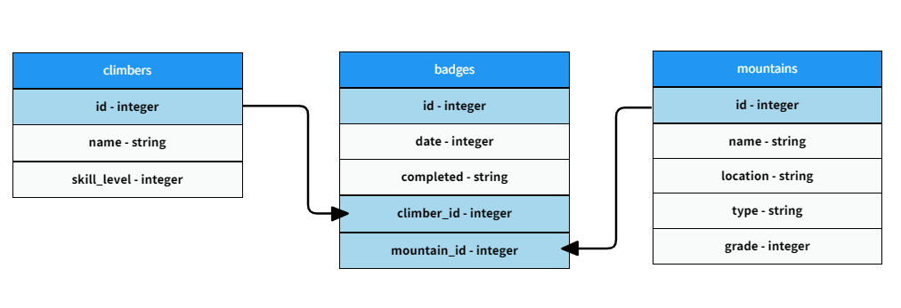

<h1>Send It! - Your Personal Climbing Passport</h1>

"Send It!" is a project designed for climbers to create and manage their personalized climbing passports. Similar to the functionality of popular platforms like AllTrails, this application empowers users to explore a map, discover mountains of interest, and add them to their climbing badge collection. Each badge represents a climb attempted or completed, forming a unique climbing passport for the user.

Built using React for the frontend and Python for the backend, "Send It!" seamlessly combines an intuitive user interface with powerful functionality. Climbers can not only add new badges but also edit or delete existing ones, providing a dynamic and customizable experience. Whether tracking conquered summits or planning future adventures, "Send It!" is the ideal companion for climbers passionate about documenting and sharing their climbing journey.

Created and built by Eileen Burdekin and Meaghan Sharrard.

<h1>Project Details</h1>

<h3>Client</h3>

Contains the following components:

<ul>
    <li>App.js</li>
    <li>ClimbingPassport.js</li>
    <li>Explore.js</li>
    <li>Home.js</li>
    <li>Login.js</li>
    <li>Logout.js</li>
    <li>NavBar.js</li>
</ul>

<h3>Server</h3>

Contains three models: Climber, Mountain, and Badge. A Climber has many Mountain(s) through Badge(s), a Mountain has many Climber(s) through Badge(s), and a Badge belongs to a Climber and belongs to a Mountain. All of a climber's badges are contained on the frontend as a collection called Climbing Passport.

<h1>Using this Program</h1>

<h3>Home</h1>
Prompts a user to log into an existing account or create a new one. The user is unable to navigate to the various tabs unless logged in. Once logged in, the home page will welcome the user and they can navigate to the various tabs as needed.

<h3>Explore</h3>
The user can add a new climb to their badges and explore various climbs using the world map and mountain list. Once the plus sign next to the mountain is clicked, a modal will populate and they will be prompted to add the date, whether the climb has been completed or not, climber ID, and mountain ID. Once this new climb has been added, it will be saved under the "My Climbing Passport" tab.

<h3>My Climbing Passport</h3>
This page contains a collection of all the user's badges. A badge can be edited or deleted on this page. If the update button is selected, a modal will populate and the user can edit the existing information. Once this information is saved, it will automatically update on the page.

If the delete button is clicked, the badge will automatically be removed from the page.

<h3>Send It!</h3>
Takes the user back to the personalized homepage.

<h3>Logout</h3>
 
Takes the user back to the original home page, where they will be prompted to log in or create a new account.
